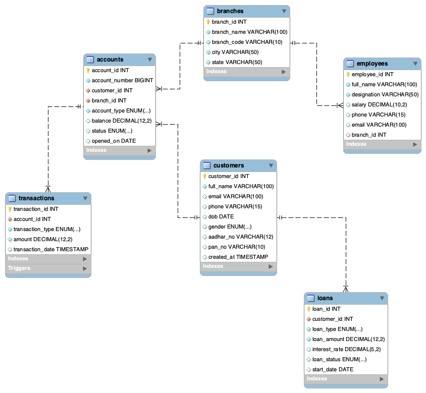

# 🏦 Banking Management System (MySQL)

A professional Banking Management System developed using **MySQL**. This project demonstrates relational database design, SQL queries, views, stored procedures, triggers, and ER modeling.

---

## 📌 Project Overview

This project simulates the backend database of a banking system where customers can open accounts, perform transactions, take loans, and interact with different bank branches.

The project is designed to showcase SQL and MySQL skills required for **Data Analyst** and **Database Developer (MySQL)** roles.

---

## 🚀 Features

- Customer Management
- Branch Management
- Account Management
- Transaction Management
- Employee Management
- Loan Management
- SQL Views
- Stored Procedures
- Database Triggers
- ER Diagram

---

## 🛠 Technologies Used

- MySQL 8
- MySQL Workbench
- SQL

---

## 📂 Database Tables

- Branches
- Customers
- Accounts
- Transactions
- Employees
- Loans

---

## 🗺 ER Diagram

---

## 📸 Project Screenshots

### Database Tables

### Customers

### Accounts

### JOIN Query

### View Output

### Stored Procedure

### Trigger (Before)

### Trigger (After)

---

## 📚 SQL Concepts Used

- CREATE DATABASE
- CREATE TABLE
- PRIMARY KEY
- FOREIGN KEY
- INSERT
- SELECT
- INNER JOIN
- GROUP BY
- ORDER BY
- WHERE
- UPDATE
- DELETE
- VIEW
- STORED PROCEDURE
- TRIGGER

---

## ▶️ How to Run

1. Open MySQL Workbench.
2. Create a new SQL script.
3. Open `Banking_Database_System.sql`.
4. Execute the script.
5. Explore the database using the included queries.

---

## 👨‍💻 Author

**Pikesh Kumar**

GitHub: https://github.com/pikesh-kumar